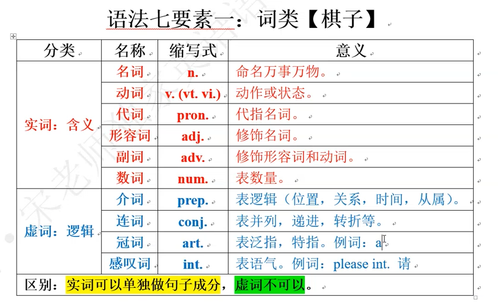
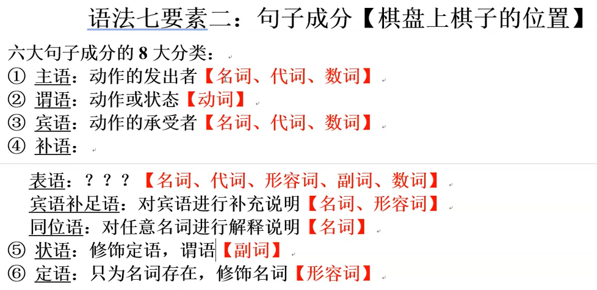
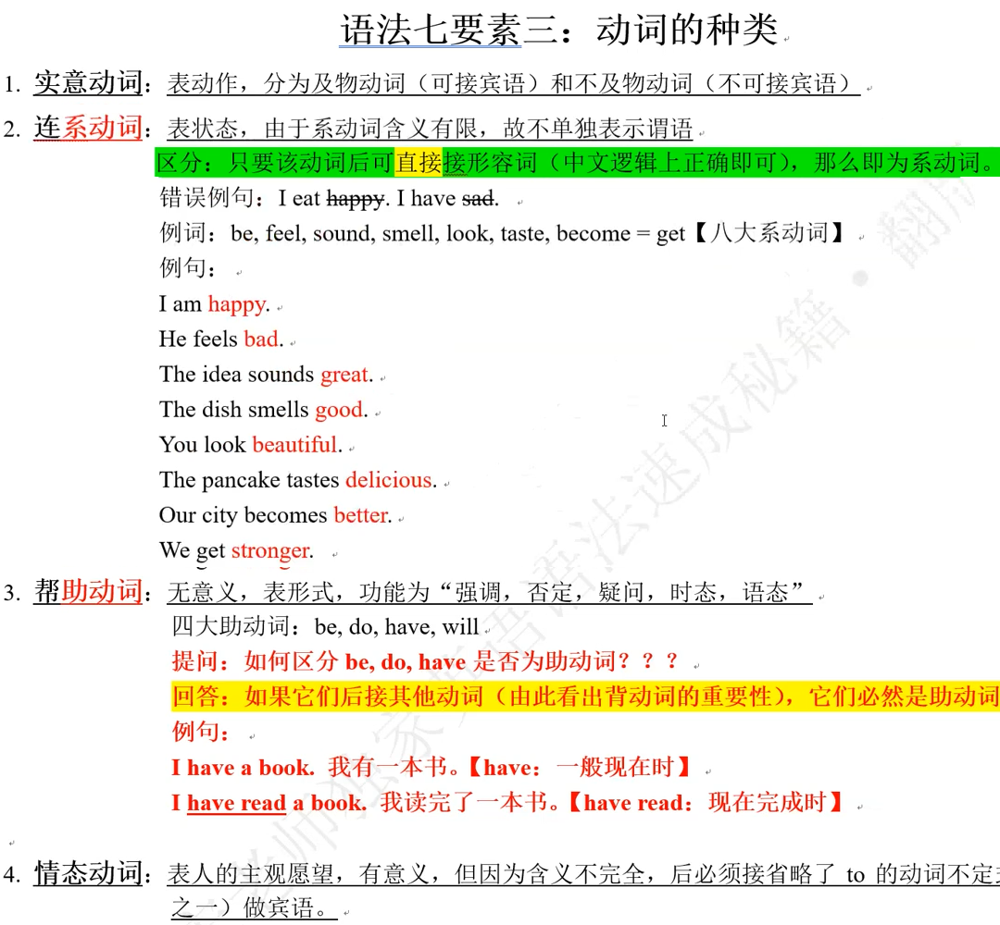
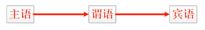
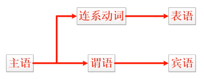
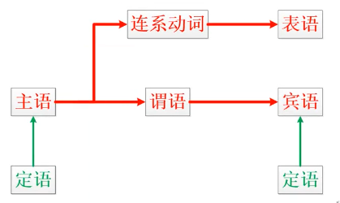
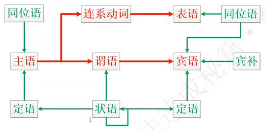
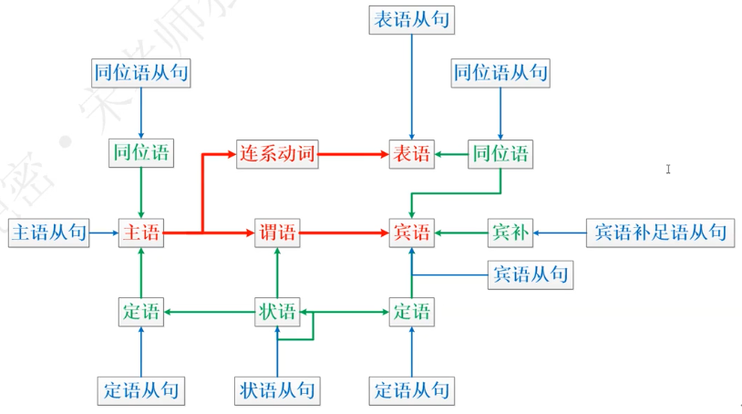
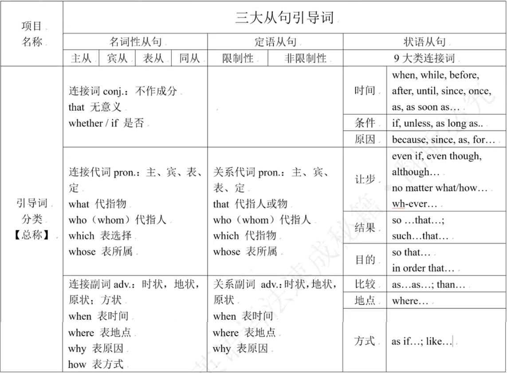

# 一、语法七要素
## 词性（词类）

## 二、句子成分

## 三、动词种类

## 四、时态
### 动词时态【以四大助动词为例】
非谓语：现在分词、过去分词、不定式
原型 | 第三人称 | 过去式 | 现在分词 | 过去分词  | 不定式
|-------|:-------:|------:|------:|------:|------:|
| do | dose | did | doing | done | to do |
| be | is | was/were | being | been | to bo |
| have | has | had | having | had | to have |
| will | will | would | - | - | - |

### 时态名称表 + 公式总表
 时间/状态 | 一般 | 进行 be | 完成 have | 完成进行 have been
|-------|:-------:|------:|------:|------:|
| 将来 will | 一般将来时 I will do | 将来进行时 I will be doing | 将来完成时 I will have done | 将来完成进行时 I will have been doing |
| 现在 | 一般现在时 I do | 现在进行时 I an doing | 现在完成时 I have done | 现在完成进行时 I have been doing |
| 过去 | 一般过去时 I did | 过去进行时 I was doing | 过去完成时 I had done | 过去完成进行时 I had been doing |
| 过去将来 would | 过去将来时 I would do | 过去将来进行时 I would be doing | 过去将来完成时 I would have done | 过去将来完成进行时 I would have been doing |
 

### 完整公式
 时间/状态 | 一般 | 进行 be | 完成 have | 完成进行 have been
|-------|:-------:|------:|------:|------:|
| 将来 will | 一般将来时 I will do I will be | 将来进行时 I will be doing | 将来完成时 I will have done I will have been | 将来完成进行时 I will have been doing |
| 现在 | 一般现在时 I do He dose I an You are She is | 现在进行时 I an doing you are doing she is doing | 现在完成时 I have done He has done You have been She has been | 现在完成进行时 I have been doing She has been doing |
| 过去 | 一般过去时 I did I was you were | 过去进行时 I was doing you were doing | 过去完成时 I had done She had been | 过去完成进行时 I has been doing |
| 过去将来 would | 过去将来时 I would do She would be | 过去将来进行时 I would be doing | 过去将来完成时 I would have done | 过去将来完成进行时 I would have been doing |
 
谓语=动词+时态变化
非谓语=不能单独表示时态的动词一律被用作非谓语，但仍保留动词部分功能

## 五、句子流程图
### 五大核心句式
1、主语 + 谓语
- 【Love died. 爱情死了】

2、主语 + 谓语 + 宾语
- 【I loved her. 我曾经爱过他】

3、主语 + 谓语 + 间接宾语 + 直接宾语
- 【I gave her love. 我曾给过她爱】
- 【I gave her a apple. 我曾给过她一个苹果】

4、主语 + 谓语 + 宾语 + 宾语补足语
- 【 Love made her happy。爱情曾使她快乐。】
- 总结：只有含有“使…”使役动词可以后接宾语补足语。
- 例句：直接含有“使动含义”的动词：make,let=have,ask
  - You make this job better
  - Manners make me a man。礼节使我成为君子。
- 间接含有“使动含义”的动词：tell
  - I have told you to finish this homework by yourself
  - 主      谓   宾            宾补【因为非谓语 to finish的逻辑主语是you】
- 持别强调：英语中主干部分要根据实际含义来确定，修饰部分要根据形势来理解。
 
5、主语 + 系动词 + 表语 【Love is nice
爱情是美好的。】

6、谓语/系统词 + （宾语/表语）【祈使句】
- 特别总结：含有谓语（系动词）的就是句子，其他成分缺失也依然是句子
- 例句
  - Stop
  - Be it。就这样吧

### 句式流程图
#### 1、绝对核心架构

#### 2、双重核心架构

#### 3、加入定语

#### 4、加入完整的定状补

#### 5、从句的由来
<!--  -->

#### 6、句式终极流程图

## 六、三大从句引导词
概念：从句其实就是用一个句子替代了另一个句子中的句子成分

引导词的意译：区分主句和从句，引导词必须置于从句的句首

例如：当年在初一阶段学习特殊疑问句时，特殊疑问词

疑问代词：what,who, which, whose

疑问副词：when, where,why,how

## 七、单词与句子成分互换

# 基础语法
- 基础语法
  - 词法
    - 第一梯队
      - 动词
        - 动词时态
        - 动词语态和语气
        - 非谓语动词
      - 名词
    - 第二梯队 
      - 代参
      - 形容词
      - 副词
      - 介词和介词短语
    - 第三梯队
      - 冠词
      - 连词
      - 数词
      - 感叹词
  - 句法
    - 句子类型
      - 简单句
      - 并列句
      - 复合句
    - 三大从句
      - 名词性从句
      - 形容词性从句
      - 副词性从句
    - 核心句式
      - 主谓一致
      - 句子倒转
      - 强调句式
      - 省略和独立主格结构
      - 其他句式
