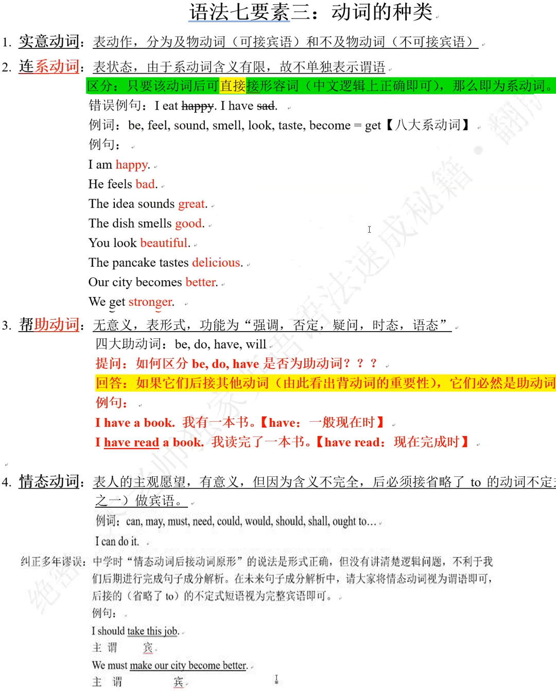
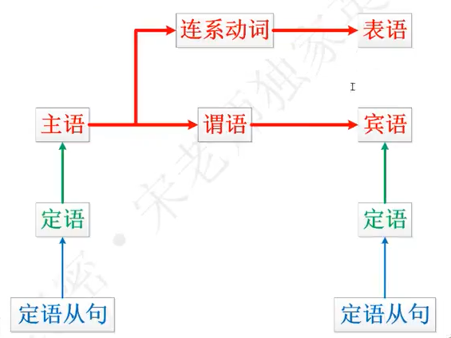

# 一、语法七要素
## 词性（词类）


## 二、句子成分


## 三、动词种类

```
vt：vt是及物动词，后面直接加名词。
vi：vi是不及物动词，后面bai不能直接跟名词，需要加一个to。
```

## 四、时态
### 动词时态【以四大助动词为例】
非谓语：现在分词、过去分词、不定式
原型 | 第三人称 | 过去式 | 现在分词 | 过去分词  | 不定式
|-------|:-------:|------:|------:|------:|------:|
| do | dose | did | doing | done | to do |
| be | is | was/were | being | been | to bo |
| have | has | had | having | had | to have |
| will | will | would | - | - | - |

### 时态名称表 + 公式总表
 时间/状态 | 一般 | 进行<br>be | 完成<br>have | 完成进行<br>have been
|-------|:-------:|------:|------:|------:|
| 将来<br>will | 一般将来时<br>I will do | 将来进行时<br>I will be doing | 将来完成时<br>I will have done | 将来完成进行时<br>I will have been doing |
| 现在 | 一般现在时<br>I do | 现在进行时<br>I an doing | 现在完成时<br>I have done | 现在完成进行时<br>I have been doing |
| 过去 | 一般过去时<br>I did | 过去进行时<br>I was doing | 过去完成时<br>I had done | 过去完成进行时<br>I had been doing |
| 过去将来<br>would | 过去将来时<br>I would do | 过去将来进行时<br>I would be doing | 过去将来完成时<br>I would have done | 过去将来完成进行时<br>I would have been doing |
<br>

### 完整公式
 时间/状态 | 一般 | 进行<br>be | 完成<br>have | 完成进行<br>have been
|-------|:-------:|------:|------:|------:|
| 将来<br>will | 一般将来时<br>I will do<br>I will be | 将来进行时<br>I will be doing | 将来完成时<br>I will have done<br>I will have been | 将来完成进行时<br>I will have been doing |
| 现在 | 一般现在时<br>I do<br>He dose<br>I an<br>You are<br>She is | 现在进行时<br>I an doing<br>you are doing<br>she is doing | 现在完成时<br>I have done<br>He has done<br>You have been<br>She has been | 现在完成进行时<br>I have been doing<br>She has been doing |
| 过去 | 一般过去时<br>I did<br>I was<br>you were | 过去进行时<br>I was doing<br>you were doing | 过去完成时<br>I had done<br>She had been | 过去完成进行时<br>I has been doing |
| 过去将来<br>would | 过去将来时<br>I would do<br>She would be | 过去将来进行时<br>I would be doing | 过去将来完成时<br>I would have done | 过去将来完成进行时<br>I would have been doing |

### 被动
 时间/状态 | 一般 | 进行<br>be | 完成<br>have | 完成进行<br>have been
|-------|:-------:|------:|------:|------:|
| 将来<br>will | 一般将来时<br>I will do<br>I will be done | 将来进行时<br>I will be doing<br>I will be being done | 将来完成时<br>I will have done<br>I will have been down | 将来完成进行时<br>I will have been doing<br>I will have been being down |
| 现在 | 一般现在时<br>I do<br>I am done | 现在进行时<br>I an doing<br>I an being done | 现在完成时<br>I have done<br>I have been done| 现在完成进行时<br>I have been doing<br>I have been being done |
| 过去 | 一般过去时<br>I did<br>I was done | 过去进行时<br>I was doing<br>I was being done | 过去完成时<br>I had done<br>I had been done | 过去完成进行时<br>I has been doing<br>I has been being done |
| 过去将来<br>would | 过去将来时<br>I would do<br>I would be done | 过去将来进行时<br>I would be doing<br>I would be being done | 过去将来完成时<br>I would have done<br>I would have been done | 过去将来完成进行时<br>I would have been doing<br>I would have been being done |

```
1. I learn English。我学英语。【 learn动词原形，一般现在时
2. I learnt English。我学过英语。【 learnt是 learn的过去式，一般过去时
3. I will learn English。我将要学英语。【 will learn一般将米时】
4. I would learn English。我本来要学英语。【 would learn过去将来时】
5. I am learning English。我正在学英语。【 am learning现在进行时】
6. I was learning English。那时我正在学英语。【 was learning过去进行时
7. I have learnt English。我已经学了英语。【 have learnt现在完成时】
8. I had learnt English。那时我已经学了英语。【 have learnt过去完成时】
9. I have been learning English。我一直在学英语。【 have been learning现在完成进行时】
10. I had been learning English。那时我一直在学英语。【 had been learning过去完成进行时】
1. I will have learnt English。那时我将已经学了英语。【 will have learnt将来完成时】
12. I will be learning English。那时我将正在学英语。【 will be learning将来进行时】
13. I would have learnt English。那时我本可以学了英语。【 would have learnt过去将来完成时
14. I would be learning English。那时我将正在学英语。【 would be learning过去将来进行时】
```

谓语=动词+时态变化
非谓语=不能单独表示时态的动词一律被用作非谓语，但仍保留动词部分功能


## 五、句子流程图
### 五大核心句式
1、主语 + 谓语
- 【Love died. 爱情死了】

2、主语 + 谓语 + 宾语
- 【I loved her. 我曾经爱过他】

3、主语 + 谓语 + 间接宾语 + 直接宾语
- 【I gave her love. 我曾给过她爱】
- 【I gave her a apple. 我曾给过她一个苹果】

4、主语 + 谓语 + 宾语 + 宾语补足语
- 【 Love made her happy。爱情曾使她快乐。】
- 总结：只有含有“使…”使役动词可以后接宾语补足语。
- 例句：直接含有“使动含义”的动词：make,let=have,ask
  - You make this job better
  - Manners make me a man。礼节使我成为君子。
- 间接含有“使动含义”的动词：tell
  - I have told you to finish this homework by yourself
  - 主      谓   宾            宾补【因为非谓语 to finish的逻辑主语是you】
- 持别强调：英语中主干部分要根据实际含义来确定，修饰部分要根据形势来理解。
 
5、主语 + 系动词 + 表语 【Love is nice
爱情是美好的。】

6、谓语/系统词 + （宾语/表语）【祈使句】
- 特别总结：含有谓语（系动词）的就是句子，其他成分缺失也依然是句子
- 例句
  - Stop
  - Be it。就这样吧

### 句式流程图
#### 1、绝对核心架构


#### 2、双重核心架构


#### 3、加入定语


#### 4、加入完整的定状补


#### 5、从句的由来
<!--  -->

#### 6、句式终极流程图


## 六、三大从句引导词
概念：从句其实就是用一个句子替代了另一个句子中的句子成分

引导词的意译：区分主句和从句，引导词必须置于从句的句首

例如：当年在初一阶段学习特殊疑问句时，特殊疑问词

疑问代词：what,who, which, whose

疑问副词：when, where,why,how


### 名词性从句

```
一、入门
概念：用一个句子取代了名词所在的句子成分，那么这个句子就被以原有的成分命名。
位置判断：
the truth= that the Earth goes around the Sun
例句：
1. The truth is the truth
      主     系     表
   主语从句： that the Earth goes around the Sun is the truth
   由于头重脚轻： It is the truth that the Earth goes around the Sun
2. We know the truth
   主  谓     宾
   宾语从句： We know that the Earth goes around the Sun
3. The truth is the truth
      主     系     表
   表语从句： The truth is that the Earth goes around the Sun
4. We know the truth
   主  谓     宾
   同位语从句： We know the truth that the Earth goes around the Sun

二、写作：根据下列步骤可以练习所有的名词性从句写作

名词性从句的三种引导词
    连接词：that, whether/if【因为连接词是虚词，虚词不作成分，置于从句句首即可】
    连接代词：who,what, whose, which【最难，连接代词就是代词，代词可代名词，所以可充当从句中的四种成分：主语，宾语、表语，定语：故会对从句的语序造成干扰。】
    连接副词：when, where,why,how【连接副词就是副词，做状语，必须置于从句的句首，虽然有意义，但是不影响从句的顺序。】

名词性从句写作5部曲
步骤1:随意写出3个陈述句：①be:②can;③实意动词
(1) He is a good doctor in this hospital
(2) The government can build a large park for citizens
(3) Our nation will finish the great plan to make all people rich

步骤2:将以上三句话改成一般疑问句的形式：
(1) Is he a good doctor in this hospital?
(2) Can the government build a large park for citizens
(3) Will our nation finish the great plan to make all people rich?

步骤3:对划线部分进行提问，改为特殊疑问句
(1) Who is a good doctor in this hospital?
(2) What can the government build for citizens?
(3) What will finish the great plan to make all people rich?

步骤4:将以上三句改为陈述语序，注意特殊疑问词的位置不变
(1) Who is a good doctor in this hospital
(2) What the government can build for citizens
(3) What will finish the great plan to make all people rich

步骤5:将以上三句视为名词性从句，代入到主句当中就可以构成主从复合句
(1) Who is a good doctor in this hospital谁是这家医院的好医生
宾语从句： I know who is a good doctor in this hospital。我知道谁是这家医院的好医生。
表语从句： The problem is who is a good doctor in this hospital。问题是谁是这家医院的好医生。
主语从句： Who is a good doctor in this hospital is unknown。谁是这家医院的好医生还不知道。
(2) What the government can build for citizens政府能够为市民建造什么
宾语从句： The newspaper will report what the government can build for citizens.
报纸将会报道政府能够为市民建造什么。
表语从句： Our question is what the government can build for citizens.
我们的问题是政府能够为市民建造什么
主语从句： What the government can build for citizens can make them happy
政府能够为市民建造什么才能让他们开心。
(3) What will finish the great plan to make all people rich什么将会完成使所有人富裕的伟大计划。
宾语从句： Everybody knows what will finish the great plan to make all people rich.
每个人都知道什么将会完成使所有人富裕的伟大计划。
表语从句： What we should know is what will finish the great plan to make all people rich
我们应该知道东西是什么将会完成使所有人富裕的伟大计划。
Ei What will finish the great plan to make all people rich will decide what future our country will have
什么将会完成使所有人富裕的伟大计划将会决定我们的国家将有什么样的未来。

(4) 关系副词的简单应用
以宾语从句为例：
when何时
Our teacher has not told us when we will set out
where何地
The great man doesn' t know where the city will go.【比喻含义：比喻城市的出路
why为什么
I asked him why he decided to quit
how如何
Scientists has shown how we can solve the problems of environment
```   

### 定语从句

```
一、概念
1.定语从句就是用一句话修饰一个名词（代词）；
2.定语从句必须置于被修饰的词之后，所以被修饰词就被称为先行词
3.定语从句的引导词代指先行词在从句中做成分
4.凡是出现名词或代词的地方就可以有定语从句。
5.如果主句时态是现在或将来，则定语从句的时态随意；如果主句的时态是过去或过去将来，那么从句的时态要与主句时态保持逻辑顺序一致。

二、写作
第1步：写出两个含有相同名词或代词的句子。
初中：
  I have a dream
  A dream is to be a teacher
高中：
  My uncle will return to China next month
  My uncle bought me a very nice handbag as my birthday's gift last year
大学：
  Our government should know about how it will leave a brighter future for next generation
我们的政府应该知道如何为下一代人留下一个更为光明的未来
  Next generation in China will face a kind of competition from globalization
中国的下一代人将面临来自全球化的竞争。

第2步：将其中一句定为主句部分，另一句自然就是从句
初中：
  I have a drean.【主句部分】
  A dream is to be a teacher.【从句部分】
高中：
  My uncle will return to China next month.【主句部分】
  My uncle bought me a very nice handbag as my birthday' s gift last year.【从句部分】
大学：
  Our government should know about how it will leave a brighter future for next generation 【主句部分】
我们的政府应该知道如何为下一代人留下一个更为光明的未来
  Next generation in China will face a kind of competition from globalization 【从句部分】
中国的下一代人将面临来自全球化的竞争。

第3步：将从句部分接入主句，放在与主句含有相同单词的后面
初中：
  I have a dream A dream is to be a teacher
高中：
  My uncle My uncle bought me a very nice handbag as my birthdays gift last year will return to China next month
大学
  Our government should know about how it will leave a brighter future for next generation Next generation in China will face a kind of competition from globalization
我们的政府应该知道如何为下一代人留下一个更为光明的未来
中国的下一代人将面临来自全球化的竞争

第4步：由于一句话中出现了相同的名词，用定语从句的引导词替换从句部分中与主句相同
的单词即可。
初中：
  I have a dream that/which is to be a teacher.【主从复合句完成】
  我有个成为一位老师的梦想。
高中：
  My uncle who/that bought me a very nice handbag as my birthday's gift last year will return to China next month
大学
  Our government should know about how it will leave a brighter future for next generation who in China will face a
kind of competition from globalization
我们的政府应该知道如何为中国的将面临来自全球化竞争的下一代人留下一个更为光明的未来。


第5步：将以上主句部分和从句部分互换位置，再写一句主从复合句。
初中
  I have a dream.【主句部分】
  A dream is to be a teacher.【从句部分】
  A dream that/which I have is to be a teacher.【主从复合句完成】
高中
  My uncle will return to China next month.【从句部分】
  My uncle bought me a very nice handbag as my birthday's gift last year.【主句部分】
  My uncle who would return to China next month bought me a very nice handbag as my birthday's gift last year
大学
  Our government should know about how it will leave a brighter future for next generation.【从句部分】
  我们的政府应该知道如何为下一代人留下一个更为光明的未来。
  Next generation in China will face a kind of competition from globalization。【主句部分】
  中国的下一代人将面临来自全球化的竞争。
  Next generation in China who our government should know about how it will leave a brighter future for will face a
kind of competition from globalization。【 For your consideration仅供参考】
  中国的下一代由我们的政府留下一个更为光明的未来的人将面临来自全球化的竞争。
```

### 状语从句
```
一、概念
  就是用一句话替代状语上的副词。
  主句和从句均是完整句（主谓宾/主系表），根据主句和从句间的逻辑关系来确定引导词为哪一类
  引导词必然置于从句的句首。
  例句
  One, I hated English。曾经我讨厌英语。
  时状 主 谓       宾
  When I was a student, I hated English。当我还是一名学生时，我就讨厌英语
   时间状语从句          主 谓     宾

二、写作
1.初阶：时间状语从句；条件状语从句；原因状语从句
  After I learnt English, I would learn French
  If you want to get what you have never had, you must do what you have never done before.【至理名言
  如果你想要获得你从未有过的东西，那么必须去做你从未做过的事情。
  I shall defeat them on the field of battle. for I am better trained

2.进阶：结果状语从句，目的状语从句，方式状语从句
结果和目的状语从句的绝对区别
  You are so nice that everybody wants to help you.【结果状语从句】
  你是如此地好以至于每个人都想帮助你。 【主句的内容决定了从句的结果】 先因后果
  You are nice so that everybody wants to help you.【目的状语从句】
  为了每个人想要帮助你，你得很好。【从句的起因决定了主句的内容】 先果后因

  结果状语从句的常见写法
    You are so handsome that many girls love you
    You are such a handsome boy that many girls love you
  总结
    so为副词，后接形容词+that
    such为形容词，后接（形容词+)名词+that
  方式状语从句在于理解：如同，像--as,asif,like
    But now i ask you to trust in your master as i have come to trust in mine
    但现在我要你相信你师傅，就像我开始相信你一样
    he asks us to trust him as we cower behind it
    他要我么信任他 要我们躲在他后面
    do as i do
    跟着我做

3.高阶：比较状语从句，让步状语从句，地点状语从句
  This will be easier than I thought
  主句部分 This will be easier
  从句部分 I thought this would be easy
  这比我想得可简单多了
  I hope the Pacific is as blue as it has been in my dreams
  主句部分 I hope the Pacific is blue
  从句部分 it has been blue in my dreams
  我希望太平洋如梦中一般蓝
  三最口腔肌肉训练法：
    as quickly as （it is ）possible
    as loudly as(it is )possible
    as clearly as(it is )possible
    例句
    I must do my job as quickly as （it is)possible.

```

## 七、单词与句子成分互换


#### 介宾短语 只是介词短语的一类，但是占比高达99%
```
1.介词+名词（代词）
2.介词+动名词短语（非谓语）
3.介词+宾语从句（除了that）
母语式写作入门：汉译英
  中文含义构建：先直译，后意译
  绝对标注：构建中文含义的时候，必须按照句式流程图构建。
    例句：曾经，我有一个和自己志趣相同的朋友一起共同创业的机会。
      绝对框架：I had a chance
      就近修饰：Once, I had a chance to make a careen.
      完成表述：Once, I had a chance to make a career together with friends who had the same interests
    例句：虽然我坚持学习英语已经快两年了，但是到现在为止我还是没有学好英语的信心
      绝对框架：I have been learning English， I don't have confidence
      就近修饰：I have been learning English persistently almost for tow years，until now , I still don't have confidence to learn English well
      完成表述：Although I have been learning English persistently almost for tow years，until now , I still don't have confidence to learn English well
```

#### 非谓语动词短语
```
起源：一套主谓宾（系表）当中有且只能有一个动词。
举例：老师要我去办公室。（ ask sb. to do sth.)
      The teacher asks me to go to office.【togo表一般将来时】
      昨天，老师要我去办公室。
      The teacher asked me to go to office yesterday。【togo表过去将来时】

非谓语动词的形式：虽然变了形式的动词不能做谓语，但是依然保留了动词的特征一一时态。
1.动词不定式：to do（表将来时）

2.动名词： doing（就是名词
例句： My job is teaching English。【逻辑含义決定是动名词还是坝在分词】

3.现在分词： doing（表进行时）
例句： There is a car waiting for you
      There is a car which is waiting for you
      There was a car waiting for you
      There was a car which was waiting for you.

4.过去分词：done（被动和完成时）
I am reading a book written by my friend.
I am reading a book which was written by my friend

5.醐译非谓语的时候，一定要找到对应的逻辑主语
```

# 基础语法
- 基础语法
  - 词法
    - 第一梯队
      - 动词
        - 动词时态
        - 动词语态和语气
        - 非谓语动词
      - 名词
    - 第二梯队 
      - 代参
      - 形容词
      - 副词
      - 介词和介词短语
    - 第三梯队
      - 冠词
      - 连词
      - 数词
      - 感叹词
  - 句法
    - 句子类型
      - 简单句
      - 并列句
      - 复合句
    - 三大从句
      - 名词性从句
      - 形容词性从句
      - 副词性从句
    - 核心句式
      - 主谓一致
      - 句子倒转
      - 强调句式
      - 省略和独立主格结构
      - 其他句式
